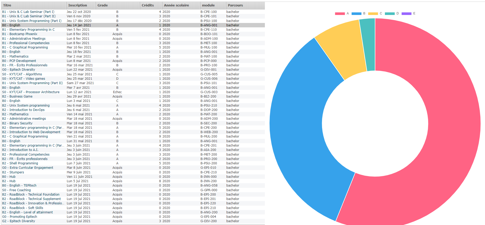

# Use chart on intranet



We will use the chart on an intranet page. For this we will add a chart for grade on your profile page.

for this first of all we will update the manifest to add the chart plugin.

```json 
...
"content_scripts": [
        {
            "matches": [
                "https://intra.epitech.eu/",
                "https://intra.epitech.eu/*"
            ],
            "js": ["Chart.min.js", "index.js"]
        }
    ],
...
```

Then we will go to the index.js file and start to code and edit chart.js

Go on this [link](https://intra.epitech.eu/user/#!/notes/all).

Here was the page we will use to get the data for our chart.

Here documentation for chart.js [link](https://www.chartjs.org/docs/latest/samples/other-charts/doughnut.html).

```javascript
// I put css  and html basic for setup the chart you just need to create chart and data
function createChart() {
    if (document.location.href !== "https://intra.epitech.eu/user/#!/notes/all") return;
    document.getElementsByClassName("clickzone ui-selectable")[0].style = "display: flex; flex-direction: row; flex-wrap: nowrap; justify-content: center; align-items: stretch;";
    let div = document.createElement("div");
    div.id = "chartContainer";
    div.style = "position: inherit; width: 100%; height: 100%;";  
    document.getElementsByClassName("clickzone ui-selectable")[0].appendChild(div);
    let canvas = document.createElement("canvas");

    document.getElementById("chartContainer").appendChild(canvas);

    canvas.id = "myChart";
    
    // create chart here
    
}

setTimeout(() => {
    if (document.getElementsByClassName("clickzone ui-selectable")[0] === undefined) return;
    createChart()
}, 1000);

<<<<<<< Updated upstream
```
=======
setTimeout(() => {
    if (document.getElementsByClassName("calendar planner daysview")[0] === undefined) return;
    createChart()
}, 2000);

```
>>>>>>> Stashed changes
